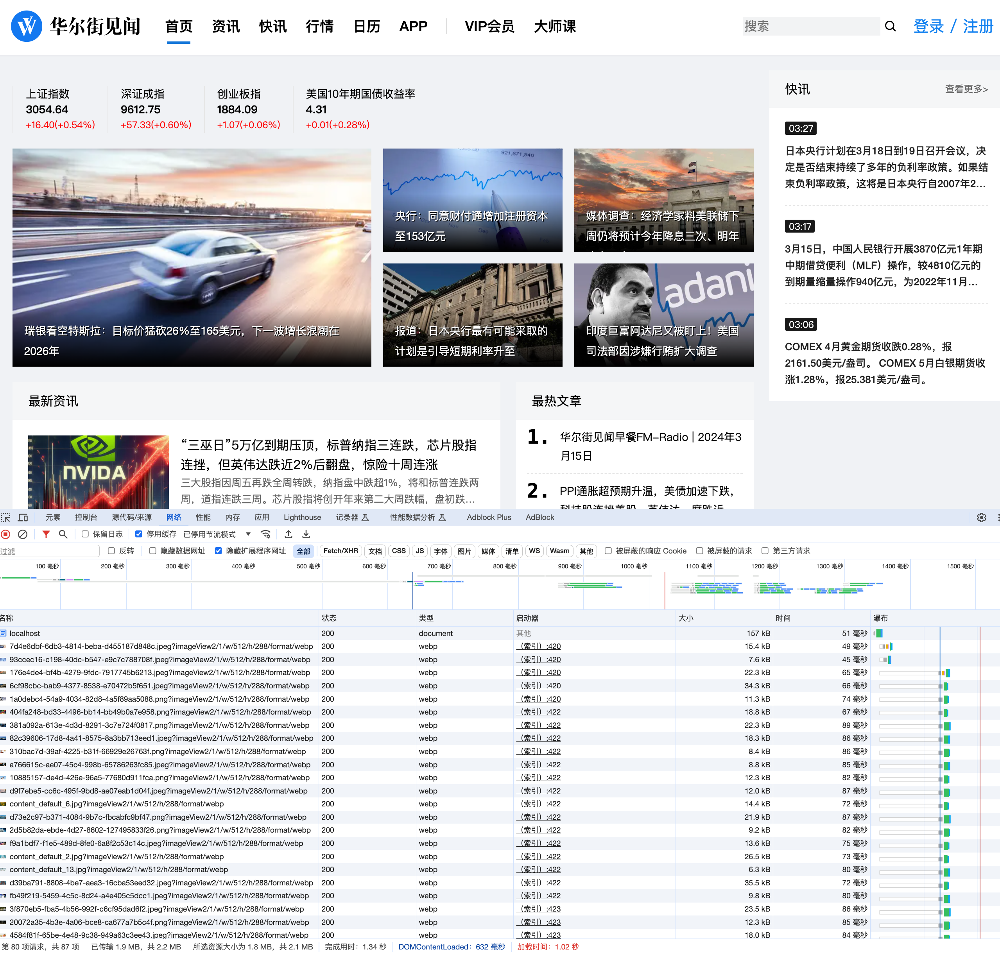

## ssr_svelte_benchmarks [进行中]

### 项目简介

本地与云端的serverless JS Runtime 环境 + Svelte SSR 的性能测试: Demo华尔街见闻首页(80%的页面内容)

[视频演示](./README.mp4)

[演示地址](https://ssr-svelte-benchmark.netlify.app/)

#### 目录结构

    ├── app.yaml                      # 云函数配置
    ├── crawler_wallstreetcn          # go爬虫程序API
    ├── package.json
    ├── src                           # sveltekit
    │   ├── app.css
    │   ├── app.html
    │   ├── lib
    │   │   ├── redis.ts
    │   │   └── type.ts
    │   └── routes     
    │       ├── +layout.svelte          # 布局
    │       ├── +page.server.ts         
    │       ├── +page.svelte
    ├── svelte.config.js
    ├── vite.config.js
    └── wasmer.toml

### 数据来源

crawler_wallstreetcn 该目录为Golang编写的爬虫程序,华尔街见闻首页的数据API,包括最新文章,快讯、股票上证指数、大师课等.存储到Redis中用以缓存数据

### 测试脚本

    wrk -t12 -c400 -d10s http://127.0.0.1:3000

### 云端环境 数据

|  Cloud (点击跳转演示)              | Request/10S | 备注                                                     |
| ------------------------------ |----------- | ------------------------------------------------------------ |
| [Vercel](https://ssr-svelte-benchmark.vercel.app)       | 3522        | 科学上网                                                       |
| [Netlify](https://ssr-svelte-benchmark.netlify.app/)         | 233        |稳定,会被ban一会儿,压测有防火墙导致数据异常|
| [Cloudflare Page](https://ssr-svelte-benchmark.pages.dev/)          |  580         | 还挺稳定,每日限请求数,直接访问       |
| [Cloudflare Worker](https://ssr-svelte-benchmark.gakaki.workers.dev/)              |   522       | 科学上网, 和Pages数据差不多                                                 |
| AWS Lambda        |    待续       | 测试AWS LLRT 低延迟QuickJS 需要付费          |
| Deno Deploy         |   待续       | 待测试本地报错 [adpater deno](https://github.com/pluvial/svelte-adapter-deno) |
| 阿里云FC函数计算         |   待续       | 计划 |
| Wasmer(Winter.js)         |   待续       | 例子为静态文件生成不具有对比性 |

### 本地测试环境 数据

MacBook Air M1 2020 16G 256G

外网服务器测试脚本:
| JS Runtime                     | 演示地址                    | Request/10S | 备注内容                                                     |
| ------------------------------ | --------------------------- | ----------- | ------------------------------------------------------------ |
| [Node](http://baidu.com)       | [Runtime](http://baidu.com) | 455        | V8引擎                                                       |
| [Bun](http://baidu.com)        | [Runtime](http://baidu.com) |  352.84        | zig+safafri js core    没有传言的快啊 v8 jit的关系                                    |
| [Wasmer](http://baidu.com)     | [Runtime](http://baidu.com) |         | WinterJS,Rust+SpiderMonkey(Firefox的JS引擎)                  |
| [Deno](http://baidu.com)       | [Runtime](http://baidu.com) |         | 运行报错                                                     |
| [GraalVM_JS](https://www.graalvm.org/javascript/) | [Runtime](http://baidu.com) |         | 尚未测试,把JS编译为bytecode二进制                            |
| [Aws LLRT](http://baidu.com)   | [Runtime](http://baidu.com) |         | 本地运行报错,亚马逊 AWS 的 QuickJS低延迟启动特性 版本,启动快, |
| [ssr-rs](https://github.com/Valerioageno/ssr-rs?tab=readme-ov-file)         |   听说性能2~3倍Node方案       | 待续 Rust+V8 SSR 直出 |

### [本地环境 配置](./README_FAAS.md)
### [云端 Serverless Faas 环境 配置](./README_Local.md)

#### [本地环境 压测数据](./README_benchmark_local.md)
#### [云端 Serverless Faas 压测数据](./README_benchmark_faas_cloud.md)

### Webp avif格式可以减少图片大小到 70%

[原图jpeg格式](https://wpimg-wscn.awtmt.com/7d4e6dbf-6db3-4814-beba-d455187d848c.jpeg?imageView2/1/w/512/h/288) 21.9kb 

[webp格式](https://wpimg-wscn.awtmt.com/7d4e6dbf-6db3-4814-beba-d455187d848c.jpeg?imageView2/1/w/512/h/288/format/webp) 15.4kb 
可在七牛云里打开 avif webp 自适应,可自动检测手机浏览器自动转换无需追加url

[CanIUse兼容性良好](https://caniuse.com/?search=webp)

[avif格式](https://wpimg-wscn.awtmt.com/7d4e6dbf-6db3-4814-beba-d455187d848c.jpeg?imageView2/1/w/512/h/288/format/avif)报错 预计可以到55% 65%

    {"error":"The output format is avif, please use pfop or workflow service"}

    

